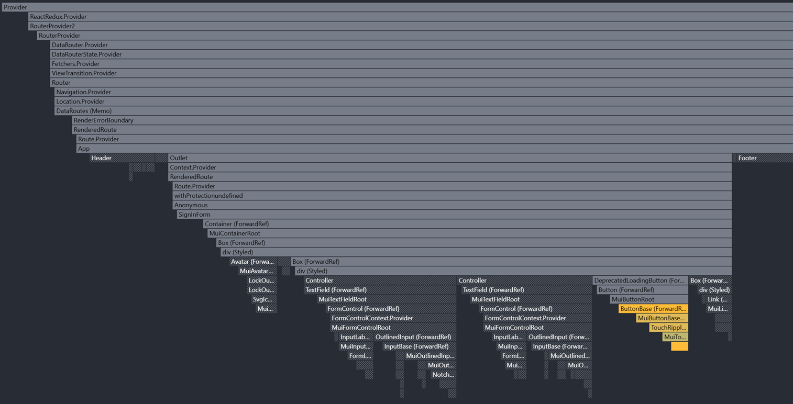
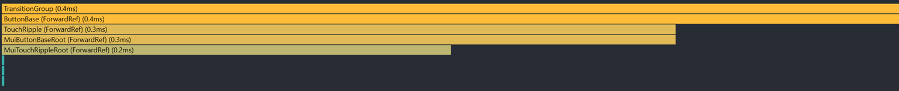

# 1. Сделал tsconfig под себя
# 2. Сделал eslint под себя
# 3. Добавил сборку на vite
# 4. Добавил сборку на swc и esbuild
# 5. Обновил зависимости
# 6. Поправил код под новый линтер
# 7. Стабилизировал сборку на Webpack
  Результат сборки на Webpack:
```ignorelang
> react-final@1.0.0 build
> cross-env NODE_ENV=production webpack --config webpack/webpack.config.cjs --env env=prod

[dotenv@17.2.3] injecting env (1) from .env -- tip: ⚙️  write to custom object with { processEnv: myObject }
assets by path static/ 764 KiB
  asset static/scripts/main.de4fe679b71dc10cf108.js 714 KiB [emitted] [immutable] [minimized] [big] (name: main) 1 related asset
  asset static/styles/main.246ccfaf9993bfdfbf68.css 50.1 KiB [emitted] [immutable] (name: main)
asset index.html 559 bytes [emitted]
asset favicon.svg 380 bytes [emitted]
asset robots.txt 24 bytes [emitted] [from: public/robots.txt] [copied]
Entrypoint main [big] 764 KiB = static/styles/main.246ccfaf9993bfdfbf68.css 50.1 KiB static/scripts/main.de4fe679b71dc10cf108.js 714 KiB
orphan modules 3.11 MiB (javascript) 17.4 KiB (runtime) [orphan] 1102 modules
runtime modules 2.06 KiB 5 modules
cacheable modules 2.31 MiB (javascript) 50.1 KiB (css/mini-extract)
  javascript modules 2.31 MiB 21 modules
  css modules 50.1 KiB
    modules by path ./src/shared/ 12.4 KiB 7 modules
    modules by path ./src/widgets/ 7.51 KiB 5 modules
    modules by path ./src/pages/ 13.8 KiB 4 modules
    modules by path ./src/app/ 2.58 KiB 2 modules
    css ./node_modules/css-loader/dist/cjs.js??ruleSet[1].rules[4].use[1]!./node_modules/postcss-loader/dist/cjs.js!./node_modules/react-toastify/dist/ReactToastify.css 13.7 KiB [built] [code generated]

WARNING in asset size limit: The following asset(s) exceed the recommended size limit (244 KiB).
This can impact web performance.
Assets:
  static/scripts/main.de4fe679b71dc10cf108.js (714 KiB)

WARNING in entrypoint size limit: The following entrypoint(s) combined asset size exceeds the recommended limit (244 KiB). This can impact web performance.
Entrypoints:
  main (764 KiB)
      static/styles/main.246ccfaf9993bfdfbf68.css
      static/scripts/main.de4fe679b71dc10cf108.js


WARNING in webpack performance recommendations:
You can limit the size of your bundles by using import() or require.ensure to lazy load some parts of your application.
For more info visit https://webpack.js.org/guides/code-splitting/

webpack 5.102.1 compiled with 3 warnings in 8766 ms

Process finished with exit code 0
```

Запуск DEV на webpack:
```ignorelang
> react-final@1.0.0 start
> webpack serve --config webpack/webpack.config.cjs --env env=dev

[dotenv@17.2.3] injecting env (1) from .env -- tip: 🔐 prevent committing .env to code: https://dotenvx.com/precommit
<i> [webpack-dev-server] Project is running at:
<i> [webpack-dev-server] Loopback: http://localhost:8080/, http://[::1]:8080/
<i> [webpack-dev-server] On Your Network (IPv4): http://192.168.0.105:8080/
<i> [webpack-dev-server] Content not from webpack is served from 'C:\Work\react_final\webpack\dist' directory
<i> [webpack-dev-server] 404s will fallback to '/index.html'
<i> [webpack-dev-middleware] wait until bundle finished: /
asset static/scripts/main.js 11.3 MiB [emitted] (name: main)
asset index.html 514 bytes [emitted]
asset favicon.svg 380 bytes [emitted]
asset robots.txt 24 bytes [emitted] [from: public/robots.txt] [copied]
orphan modules 1.19 MiB [orphan] 610 modules
runtime modules 32.6 KiB 18 modules
cacheable modules 3.78 MiB
  modules by path ./node_modules/ 3.4 MiB 411 modules
  modules by path ./src/ 397 KiB
    modules by path ./src/shared/ 202 KiB 71 modules
    modules by path ./src/pages/ 94.9 KiB 30 modules
    modules by path ./src/widgets/ 75 KiB 25 modules
    modules by path ./src/app/ 24 KiB
      modules by path ./src/app/styles/*.css 17.6 KiB 4 modules
      modules by path ./src/app/*.tsx 6.37 KiB
        ./src/app/App.tsx 1.47 KiB [built] [code generated]
        + 2 modules
    ./src/index.tsx 1.34 KiB [built] [code generated]
webpack 5.102.1 compiled successfully in 11422 ms
```
# 8. Запись профайлера исходного приложения


# 9. Стабилизировал сборку на Vite
# 10. Стабилизировал сборку на EsBuild
# 11. Ленивый роутинг
# 12. Добавил кастомный тултип через React Portal
# 13. Добавил модальный диалог через React Portal
